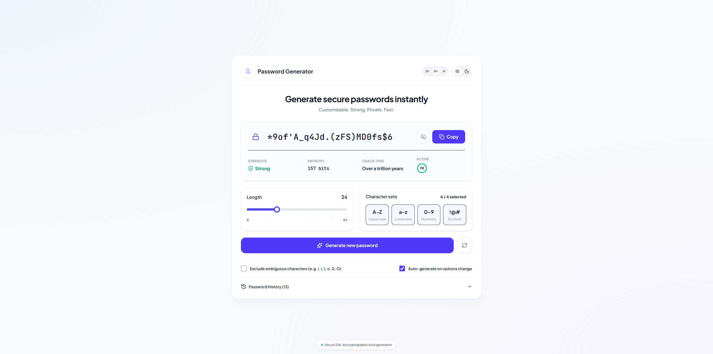

#  PassForge - Secure Password Generator

PassForge is a clean, modern, premium SaaS-style client-side secure password generator. Built with Vue 3, Vite, TypeScript, and Tailwind CSS v4, it features a highly polished design based on modern UI aesthetics.



## ✨ Features

- **1:1 Premium UI Design**: A meticulously crafted interface featuring a clean, modern light theme and a matching slate-indigo dark theme.
- **Cryptographically Secure**: Passwords are generated 100% locally in the browser using the cryptographically secure pseudo-random number generator (`window.crypto.getRandomValues`), ensuring your data never leaves your device.
- **Real-time Security Metrics**:
  - **Strength Indicator**: Dynamic shield check status badges (Very Weak, Weak, Medium, Strong).
  - **Entropy Calculator**: Computes password complexity in bits.
  - **Crack Time Estimator**: Estimates guess times based on 100 Billion attempts per second.
  - **Circular Score Progress**: Beautiful SVG-based vector ring depicting overall security score (0-100).
- **Interactive Configurations**:
  - **Dynamic Length Slider**: Modern range slider featuring dynamic track highlighting and tick indicators.
  - **Checkmark Selection Cards**: Touch-friendly card toggles for character sets with blue badge check indicators.
- **Collapsible Local History**: Safely stores up to 15 generated passwords locally in `localStorage`, featuring view/hide toggle, quick copy, and deletion.
- **Multi-language System**: Supports **English (en)**, **Chinese (zh)**, and **Japanese (ja)**. It defaults to detecting the browser's language automatically and supports instant manual switching.

## 🛠️ Tech Stack

- **Framework**: Vue 3 (Composition API with `<script setup>`)
- **Build Tool**: Vite
- **Language**: TypeScript
- **Styling**: Tailwind CSS v4 (using CSS-first custom variant dark configuration)
- **Icons**: Lucide Icons (`@lucide/vue`)

## 🚀 Getting Started

### Prerequisites

Make sure you have Node.js installed.

### Installation

1. Clone or navigate to the repository directory.
2. Install the dependencies:
   ```bash
   npm install
   ```

### Development

Start the local development server:
```bash
npm run dev
```

### Build

Compile and minify for production:
```bash
npm run build
```

The output will be generated in the `dist` directory.
